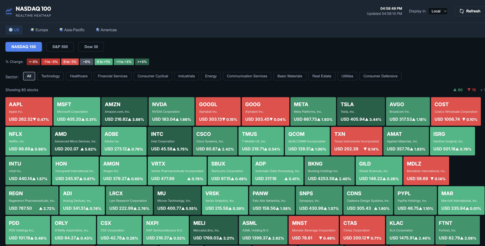

# 📈 Market Live Heatmap (PHP Edition)

A high-fidelity, real-time stock market heatmap dashboard. This application provides a visual representation of global financial markets, allowing users to monitor performance by region, index, and sector.



## 🚀 Features

- **Real-Time Data**: Live market quotes fetched directly via a PHP proxy from Yahoo Finance.
- **Global Coverage**:
  - **US**: NASDAQ 100, S&P 500, Dow 30.
  - **Europe**: FTSE 100, DAX 40, CAC 40.
  - **Asia-Pacific**: Nikkei 225, Hang Seng, Nifty 50.
  - **Americas**: TSX 60, Bovespa.
- **High-Density Heatmap**: Optimized grid view showing 80+ stocks simultaneously.
- **Advanced Filtering**: Filter by Sector (Technology, Healthcare, Financials, etc.).
- **Interactive UI**:
  - Color-coded performance (Deep Red to Deep Green).
  - Hover tooltips with detailed quote information (Price, Market Cap, Change %).
  - Auto-refresh every 30 seconds.
- **Fully Responsive**: Optimized for Mobile, Tablet, and Desktop viewports.
- **Lightweight**: Zero Node.js dependencies, runs on any standard PHP 7.4+ server.

## 🛠️ Technology Stack

- **Frontend**: Vanilla HTML5, Semantic CSS3 (Grid & Flexbox), Modern JavaScript (ES6+).
- **Backend**: PHP (>= 7.4) with `php-curl` extension.
- **Data Source**: Yahoo Finance API (via secure proxy).

## 📥 Installation & Deployment

### Prerequisites
- A web server (Apache, Nginx, or Litespeed).
- PHP 7.4 or higher installed.
- **PHP cURL extension enabled** (Required for live data).

### Steps
1. **Clone the Repository**:
   ```bash
   git clone https://github.com/egunda/stock-index.git
   cd stock-index
   ```

2. **Run Deploy Script (Linux Only)**:
   ```bash
   chmod +x install.sh
   ./install.sh
   ```

3. **Manual Setup (Non-Linux)**:
   - Move the project folder to your web root (e.g., `var/www/html` or `public_html`).
   - Ensure the `./api/` folder is readable/executable by the server.

4. **Testing Locally**:
   If you have PHP installed, you can start a local dev server immediately on the default port:
   ```bash
   sudo php -S localhost:80
   ```
   Then open `http://localhost` in your browser.

## 📁 Project Structure

```text
├── api/
│   └── proxy.php    # PHP cURL engine for fetching live quotes
├── css/
│   └── style.css    # Premium dark-theme & responsive grid logic
├── js/
│   ├── data.js      # Global index & sector definitions
│   └── app.js       # Core dashboard logic & state management
├── index.php        # Main application entry point
├── install.sh       # Linux environment setup script
└── README.md        # Comprehensive documentation
```

## ⚖️ License
This project is open-source and free to use.

---
*Created with love for high-performance financial visualizations.*
